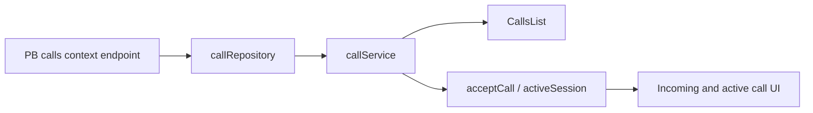

## Goal Capsule

Сделать отображение участника звонка последовательным во всех трёх состояниях: история звонков, входящий звонок и активный звонок после принятия. Для явно открытого профиля интерфейс может показывать публичные `display_name` и `avatar`; для закрытого или неизвестного профиля интерфейс всегда использует нейтральный fallback и не показывает `username`, технический `roomId` или необъявленные поля auth-record.

**Means:** ввести единый серверно разрешённый контекст участника звонка и передавать его через repository/service в `CallsList` и call session state; не получать профиль прямым клиентским чтением `users` (KTD1).

Работа не закрывает полную E2E-проверку звонка, криптографический протокол, одноразовые комнаты или общую модель PocketBase authorization.

## Product Contract

### Problem Frame

После исправления privacy-safe UI активный исходящий звонок уже получает имя и аватар, но история звонков и путь `acceptCall` их теряют. Из-за этого один и тот же звонок отображается по-разному, а открытый профиль не получает согласованный UX.

### Requirements

- R1. `CallsList` показывает контекст участника или комнаты, полученный только из авторизованного call context DTO. Для прямого звонка с `profile_type = public` разрешены публичные `display_name` и `avatar`; для private/unknown используется нейтральное имя без аватара.
- R2. Повторный звонок из `CallsList` передаёт тот же privacy-safe `displayName/avatarUrl` в `initiateCall`, что и шапка комнаты. Технический `roomId` остаётся только внутренним аргументом операции.
- R3. `acceptCall` передаёт контекст вызывающего в `activeSession`. До получения контекста UI использует нейтральный fallback; отсутствие DTO, ошибка сети или неизвестный `profile_type` не открывают профиль.
- R4. Для групповых звонков допускается публичное имя и аватар комнаты, если они уже разрешены текущим room DTO. Нельзя собирать список имён участников из сырых `users` или показывать private/unknown member metadata.
- R5. Один серверный контекст используется и для истории, и для принятия звонка. Сервер проверяет auth и membership по `call_log_id`; клиент не может подменить участника, комнату или уровень приватности.
- R6. Одноразовые комнаты не получают этот persistent-call UX: кнопки звонков и история для них остаются скрытыми согласно текущему контракту.

### Acceptance Examples

- AE1. В истории есть звонок с открытым собеседником: отображаются его публичное имя и аватар; повторный звонок открывает активную сессию с тем же контекстом.
- AE2. В истории есть звонок с закрытым собеседником: отображается нейтральное имя и fallback-аватар или его отсутствие; `username`, raw user id и `roomId` в UI отсутствуют.
- AE3. При входящем звонке вызывающий — открытый профиль: после принятия активная сессия сохраняет публичные имя и аватар.
- AE4. При входящем звонке DTO отсутствует, профиль неизвестен или сервер вернул ошибку: входящий и активный экран остаются нейтральными, принятие звонка не падает из-за необязательного UX-контекста.
- AE5. Для одноразовой комнаты нет кнопки повторного звонка и нет попытки запросить persistent call context.

### Scope Boundaries

В scope: privacy-safe DTO/резолвер контекста звонка, `CallsList`, `acceptCall`, incoming-to-active state transfer, типы, focused tests и документация.

Не в scope: показ `username` в звонках, чтение полного профиля, изменение правил `users` вне уже принятого P0.3a, новый механизм аватар-хранилища, звонки в ephemeral-комнатах, массовая переработка call history и полноценный browser E2E.

## Planning Contract

### Key Technical Decisions

- KTD1. **Источник контекста — только серверная capability/room DTO.** Прямые `users.getOne`, `expand` полного auth-record и клиентская фильтрация запрещены; privacy boundary должна оставаться на сервере.
- KTD2. **Нейтральный fallback является валидным результатом.** Ошибка или неполный ответ не блокируют звонок и не превращаются в показ `roomId`, `username` или display-полей неизвестного происхождения.
- KTD3. **Один контракт для list и accept.** Repository получает контекст по авторизованному `call_log_id`; `CallsList` и `acceptCall` не реализуют независимые способы поиска участника.
- KTD4. **Публичные поля ограничены allowlist.** Для открытого профиля разрешены только `display_name` и `avatar`/`avatar_url`, если они уже входят в утверждённый public DTO. `username`, status, last_seen, keys и auth-поля не входят в ответ.

### High-Level Technical Design

Контекст проходит через один направленный поток:



Серверный контекст должен определить сторону звонка относительно текущего
пользователя: для входящего вызова это initiator, для исходящего direct-вызова
это другой участник комнаты, для group-вызова — разрешённый публичный room
context. Ответ должен быть минимальным и пригодным для отображения, например
`{ room_id, room_type, room_name, room_avatar_url, participant: { display_name, avatar_url } | null }`.
`room_id` используется только внутри клиента для повторного звонка и не должен
попадать в видимый текст, aria-label, toast или лог.

Если существующий authorized room/member DTO уже содержит все нужные поля,
новый endpoint не создаётся: repository переиспользует этот DTO через отдельный
adapter. Если его недостаточно, добавляется узкий route в `calls.pb.js` с
проверкой `call_log_id`, auth и membership. В обоих вариантах запрещено
ослаблять `users` rules ради UI.

### Assumptions

- Текущие public/private правила профилей и нейтральные локализованные строки
  считаются принятыми и не пересматриваются в этой задаче.
- Аватар public-профиля может отображаться только существующим безопасным
  механизмом URL/DTO; новый публичный доступ к MinIO или PocketBase-файлам не
  добавляется.
- Полная проверка двумя браузерными клиентами выполняется владельцем после
  локальных тестов и не заменяется unit-тестами.

## Implementation Units

### U1. Define and expose the privacy-safe call context

- **Requirements:** R1, R3, R4, R5, KTD1, KTD4.
- **Files:** `infra/home/pb_hooks/calls.pb.js`, `infra/home/pb_hooks/__tests__/calls.pb.test.cjs`, `app/src/lib/repositories/call.repository.ts`, `app/src/lib/services/call.service.ts`, `app/src/lib/types/calls.ts`, `app/src/lib/constants/routes.ts`.
- **Approach:** Trace the existing authorized room/member and profile DTO path first. Reuse it when sufficient; otherwise add a narrow call-context route that validates the authenticated member of the call room and returns only room display fields plus an optional public participant DTO. Model missing context as `null`, not as a technical identifier.
- **Test scenarios:** (1) member requests own call context and receives allowed public fields; (2) non-member and unauthenticated requests are denied; (3) private and unknown profiles return neutral/null participant data; (4) public profile never returns username, status, keys, auth fields or raw record; (5) malformed/nonexistent call log fails without exposing internal errors; (6) ephemeral call context is denied or omitted according to the existing room contract.
- **Verification:** focused hook tests and strict TypeScript compile/lint for the DTO and repository boundary.

### U2. Add a single client-side resolver for call display context

- **Requirements:** R1, R2, R3, R4, KTD2, KTD3.
- **Files:** `app/src/lib/services/call.service.ts`, `app/src/lib/repositories/call.repository.ts`, `app/src/features/calls/store/types.ts`, `app/src/features/calls/store/sessionSlice.ts`, `app/src/features/calls/hooks/useCallRealtime.ts` if event normalization requires it.
- **Approach:** Define a narrow `CallParticipantContext` and normalize all server responses through one resolver. `acceptCall` fetches/uses the context before setting `activeSession`; if it is unavailable, it keeps neutral defaults and still joins the call. Extend `IncomingCallSession` only with optional safe context, never with raw PB records.
- **Test scenarios:** (1) successful public context survives `acceptCall` into `activeSession`; (2) private/unknown/error produces the neutral fallback; (3) `acceptCall` still obtains the token when context lookup fails; (4) context from a stale or mismatched call log is discarded; (5) no state field contains room id as display text.
- **Verification:** focused session tests plus existing call store tests; no Dev/Prod API access.

### U3. Make CallsList and repeat-call UX consistent

- **Requirements:** R1, R2, R4, R6.
- **Files:** `app/src/features/calls/components/CallsList/CallsList.tsx`, `app/src/features/calls/components/CallsList/CallsList.test.tsx` (new), related CSS only if needed, `app/src/locales/ru/calls.ts`, `app/src/locales/en/calls.ts` if new neutral labels are required.
- **Approach:** Render `Avatar`/name from the normalized context. For a public direct peer show public name/avatar; for private/unknown show the existing neutral label. For group calls use only the approved room name/avatar. The row click and action button pass the same context to `initiateCall`; they must not derive labels from `roomId` or raw expanded records.
- **Test scenarios:** (1) public direct row renders name/avatar and repeat call receives both; (2) private direct row renders neutral identity and no username/id; (3) group row renders room context without member PII; (4) missing context renders stable fallback and remains callable; (5) ephemeral row is hidden or non-callable according to the current product rule; (6) action button does not trigger the row handler twice.
- **Verification:** focused component test with mocked call store/service and existing frontend lint/build.

### U4. Update documentation and acceptance evidence

- **Requirements:** R1–R6.
- **Files:** `docs/CURRENT_STATE.md`, `docs/ARCHITECTURE_AUDIT.md`, `docs/TESTING_PLAN.md`.
- **Approach:** Document the distinction between locally tested context propagation and owner-run two-client E2E. Do not mark full call readiness or privacy audit complete until the manual acceptance scenarios pass.
- **Test scenarios:** documentation contains no claim that unit tests prove browser E2E, no private-profile field is described as visible, and the manual matrix includes public direct, private direct, group and missing-context cases.
- **Verification:** `git diff --check` and a manual documentation consistency pass against current profile/privacy rules.

## Verification Contract

Run from `app` for frontend changes:

```bash
npm test -- --run \
  src/features/calls/components/CallsList/CallsList.test.tsx \
  src/features/calls/store/sessionSlice.test.ts \
  src/features/chat/room/components/RoomHeader/hooks/useRoomHeaderInfo.test.ts
npm run lint
npm run build
```

Run the focused PocketBase hook tests from the repository root using the
existing project command/convention for `infra/home/pb_hooks/__tests__`. Do not
connect tests to Dev/Prod API and do not print secrets or raw user data.

Owner manual acceptance on Dev with two ordinary users:

1. Public direct profile: history row and outgoing/incoming screens show the
   public display name and avatar; repeat call uses the same context.
2. Private direct profile: all call surfaces show neutral identity; no
   username, user id, room id or private avatar appears in UI, accessibility
   labels, toast or logs.
3. Group call: only approved room context is shown; no member list leaks.
4. Missing/failed context: call still connects and uses neutral fallback.
5. Ephemeral room: no persistent call history or call action is introduced.

## Definition of Done

- A single privacy-safe call context contract is used by history and `acceptCall`.
- Public profiles may show only approved display name and avatar fields.
- Private and unknown profiles fail closed to the neutral fallback.
- `CallsList` repeat-call and accepted incoming call preserve context in
  `activeSession` without exposing technical identifiers.
- Focused tests, lint, build and hook tests pass; no test connects to Dev/Prod.
- Documentation distinguishes local proof from owner-run two-client E2E.
- No abandoned fallback, raw-record path or debug logging remains in the diff.
- Full two-client audio/video and hangup verification is recorded separately by
  the owner before any release status changes.
