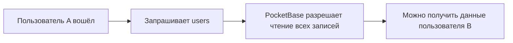
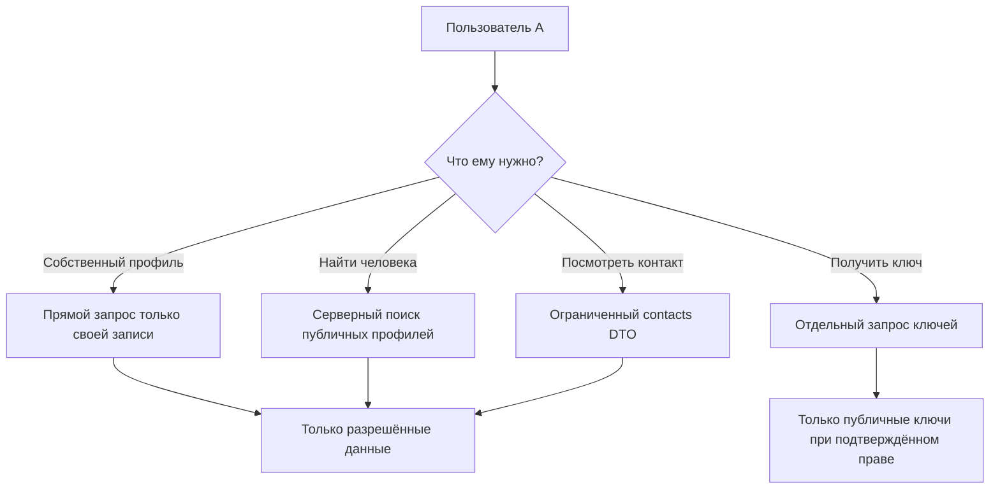

# Что предусматривает план P0.3a

Технический план лежит в файле
[`p0-3a-users-read-authorization.md`](p0-3a-users-read-authorization.md).
Этот документ объясняет его обычным языком.

## Коротко

Сейчас любой вошедший пользователь Nemo может запросить у PocketBase чужую
запись из коллекции `users`. В этой записи находятся не только имя, но и
служебные и чувствительные данные: email, настройки, приглашения и ключи.

План меняет эту модель:

- напрямую пользователь сможет читать только свою запись;
- поиск будет возвращать только явно публичные профили;
- контакты будут получать отдельный ограниченный набор данных;
- ключи для шифрования будут выдаваться отдельным серверным запросом и только
  при наличии права на их получение;
- агент подготовит проверки, а владелец отдельно выполнит их на Dev-базе с двумя
  тестовыми пользователями; сам агент к базе не подключается.

Главная цель — закрыть утечку данных, не сломав создание комнат и работу
шифрования сообщений.

## Что происходит сейчас

Упрощённо текущая схема выглядит так:



Проблема не в том, что клиент Nemo обязательно показывает все эти поля на
экране. Проблема в том, что сервер вообще отдаёт их клиенту. Проверка в
интерфейсе не является защитой: другой клиент или изменённый запрос может
получить те же данные напрямую.

## Как будет после изменения



Сервер будет принимать решение сам. Клиент не сможет сказать: «я администратор»
или «я участник этой комнаты» — это будет проверяться по данным PocketBase.

## Изменения по частям

### 1. Закрываем прямое чтение `users`

Обычный пользователь сможет:

- получить свою запись;
- изменить только то, что ему уже разрешено текущими правилами.

Обычный пользователь не сможет:

- получить запись другого пользователя по его id;
- перечислить всех пользователей;
- увидеть чужие email, настройки, приглашения или ключи через обычный API.

Администраторские операции сохраняются отдельно и не смешиваются с обычным
пользовательским доступом.

### 2. Делаем поиск безопасным

Поиск будет возвращать не «всю запись пользователя», а короткую заранее
определённую карточку:

| Можно вернуть | Нельзя вернуть через публичный поиск |
| --- | --- |
| id | email |
| username | invite_code |
| display_name | tokenKey |
| avatar, если профиль публичный | settings |
| profile_type | encrypted_profile |
|  | key_vault и закрытые ключи |

Это важно и на будущее: если в коллекцию `users` добавят новое секретное поле,
оно не попадёт в ответ автоматически.

### 3. Отделяем профиль от ключей шифрования

Публичный профиль и публичный E2EE-ключ — разные вещи.

Для ключей появится отдельный серверный запрос. Его ответ будет строго таким:

```text
{
  id,
  public_key_x25519,
  public_key_signing
}
```

Пользователь сможет получить:

- свои ключи;
- ключи явно публичного профиля;
- ключи приватного пользователя, если сервер подтвердит общую комнату.

Если человек ещё не связан с комнатой и его профиль приватный, произвольный
запрос ключа будет отклонён. Для такого сценария должен использоваться уже
существующий invite-flow.

Это нужно, чтобы простое закрытие коллекции `users` не сломало создание комнат,
но и не превратилось в новый способ читать ключи любого пользователя.

### 4. Исправляем контакты

Контакты — это не то же самое, что глобальный поиск.

Для приватного или неизвестного профиля интерфейс не должен получать:

- настоящее имя;
- username;
- avatar;
- status;
- last_seen.

Интерфейс использует нейтральное обозначение, не подставляет id комнаты или
другой технический идентификатор вместо имени.

### 5. Переводим приложение на новые запросы

Сейчас некоторые frontend-репозитории читают чужие записи `users` напрямую.
Особенно важны два места:

- создание комнаты и добавление участников;
- realtime-получение ключей для проверки сообщений.

Они будут переведены на новые серверные возможности. Если сервер не подтверждает
право на чтение, приложение завершает операцию безопасной ошибкой и не пытается
обойти правило запасным прямым запросом.

## Почему нельзя просто поменять два правила

На первый взгляд достаточно заменить правило PocketBase на «пользователь видит
только себя». Но тогда старый код, который запрашивает ключи других участников,
перестанет работать.

Поэтому порядок такой:

1. Подготовить новый серверный способ поиска и получения ключей.
2. Перевести на него frontend-код комнат и realtime.
3. Только после этого закрыть прямое чтение коллекции `users`.
4. Проверить, что старый обход действительно больше нигде не используется.

## Как это будет внедряться

Поскольку сейчас Nemo находится в режиме разработки, изменение будет сделано
в отдельной Dev-базе через Admin UI PocketBase. После этого актуальная схема
будет экспортирована в `infra/home/pb_schema.json` и закоммичена вместе с кодом.

То есть рабочий порядок будет таким:

1. агент проверяет hooks, DTO и frontend-код без подключения к базе;
2. владелец убеждается, что работает именно с Dev-базой;
3. владелец изменяет только правила `users` через Admin UI;
4. владелец экспортирует схему, а агент проверяет локальный snapshot;
5. владелец проверяет работающий Dev-сервер двумя пользователями после передачи
   изменений агентом;
5. при необходимости вернуть код на предыдущий commit и отдельно вернуть Dev-
   схему через Admin UI или пересоздать Dev-базу.

Важно: возврат Git-коммита сам по себе не меняет уже работающую базу. Но для
текущего Dev-контура это не является проблемой: база отдельная, её можно
исправить или пересоздать. Полноценные PocketBase migrations понадобятся позже,
если появятся автоматический staging, CI, несколько разработчиков или реальный
production rollout.

## Как будет проверяться безопасность

Агент подготовит тесты, но не будет подключаться к PocketBase ни прямо, ни
опосредованно. После этого владелец запустит тесты на Dev PocketBase. Prod в
этот срез не используется.

В тесте будут два обычных пользователя: A и B.

Проверки должны доказать, что:

1. A видит себя.
2. A не может прочитать B напрямую.
3. B виден в поиске только если его профиль публичный.
4. В поиске нет чувствительных полей.
5. A получает ключи только в разрешённых случаях.
6. Приватные контакты не раскрывают лишние сведения.
7. Неправильные, повторяющиеся или слишком большие списки id не расширяют
   доступ.
8. Очистка удаляет только сущности с `is_test=true` и не затрагивает обычные
   Dev-данные.

Для включения cleanup одновременно используются явный флаг и разрешённый
Dev/test URL. Это уже существующая защита тестового контура.

## Что пользователь Nemo заметит

В обычном случае — почти ничего: публичный поиск, комнаты и сообщения должны
продолжить работать.

Изменение поведения будет только там, где раньше приложение рассчитывало на
чужие приватные данные без подтверждённого права. В таком случае операция должна
завершиться понятным отказом или перейти в предусмотренный invite-flow.

## Что этот план пока не закрывает

После выполнения этого среза нельзя будет говорить, что вся безопасность Nemo
готова. Отдельно останутся:

- проверка совместимости криптографии между двумя реальными клиентами;
- media и ограничения доступа к файлам;
- presence и reactions;
- call status и другие записи звонков;
- gateway, FRP и общая release readiness.

Release `NO-GO` поэтому сохраняется до прохождения остальных обязательных
проверок.

## Текущий статус

Это объяснение и технический план подготовлены, но реализация ещё не начата.
Файл с планом является инструкцией для агента; этот файл — инструкция для
человека. План специально упрощён под текущий режим разработки и не требует
отдельной migration-инфраструктуры.

Следующий безопасный шаг — начать реализацию по техническому плану, после чего
отдельно проверить diff, тесты и документацию перед коммитом.
